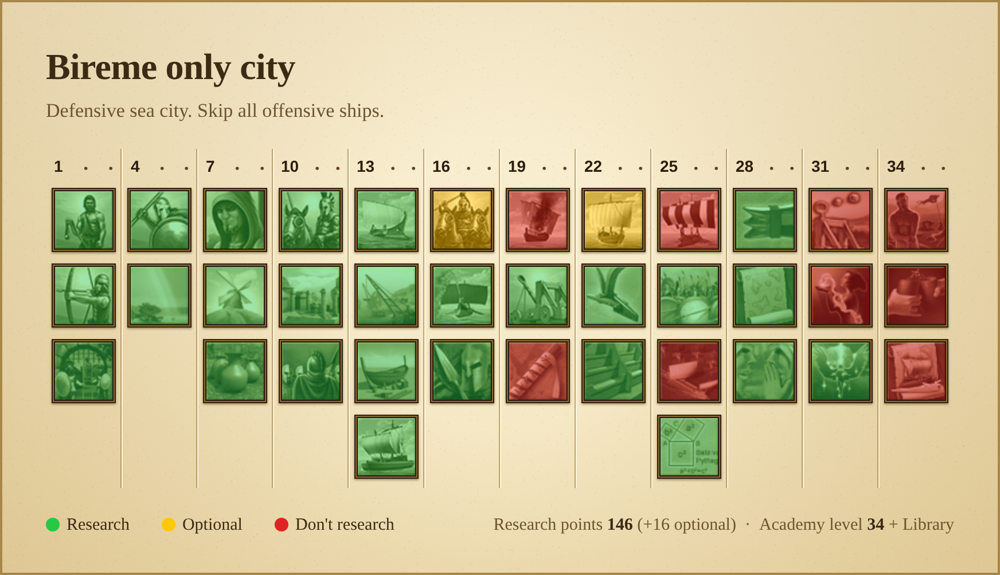

# Grepolis Research Planner

Plan which Academy researches a city should take in green, yellow and red, then download the plan as one image your alliance can follow.



## Using it

Open the planner at **https://berasenol.github.io/grepolis-research-planner/**, or open `index.html` from this repository in any browser.

- Click a research to cycle it through green, yellow and red. The arrow keys and Enter work too.
- Pick **Revolt** or **Conquest**. Revolt worlds research Revolt at level 28. Conquest worlds research Conquest there instead and add Democracy at level 19.
- Add a title and an optional note, for example "Bireme only city".
- Rename the legend if you like. It says Research, Optional and Don't research by default.
- Under the image, the planner adds up the research points for the green researches and shows in brackets what the yellow ones would add. It also works out the Academy level the city needs for all the greens: enough levels for the points (4 per level, at most 144 at level 36, plus 12 with a Library) and high enough to unlock every green research. The same summary is printed on the image. While you plan, the page also shows how many points are left at that Academy level, so you can see how much room there is for optional researches. Point costs come from the Grepolis wiki's research table.
- Pick a finish for the image: Parchment (the default), Graphite or Silver.
- **Download image** saves a PNG. **Copy image** puts it on the clipboard so you can paste it straight into Discord.

Your choices are saved in your own browser only.

## How it works

The planner is a single HTML file. React 18 and htm load from public CDNs, and everything else is inside the page, including the icons.

The icons come from the game's research sprite, `src/research-sprite.png`: 100 icons of 50×50 pixels, with a black-and-white and a colour version of every research. The planner uses the black-and-white versions and tints them 45% toward green, yellow and red when you build it.

## Building

```sh
pip3 install pillow
python3 build.py
```

This regenerates `index.html` from `src/app.html` and the sprite. `python3 build.py --fragment out.html` writes only the page content, without `<html>` and `<head>`, for embedding it somewhere else.

## Tools

`tools/grepolis_research_tint.py` downloads the research icons from the Grepolis wiki and saves green, yellow and red copies of each. The planner doesn't need it. It skips icons you already have, and when the wiki rate-limits you it waits and tries again.

## Credits

Grepolis and its research icons belong to InnoGames. This is a fan-made tool and isn't affiliated with or endorsed by InnoGames.
